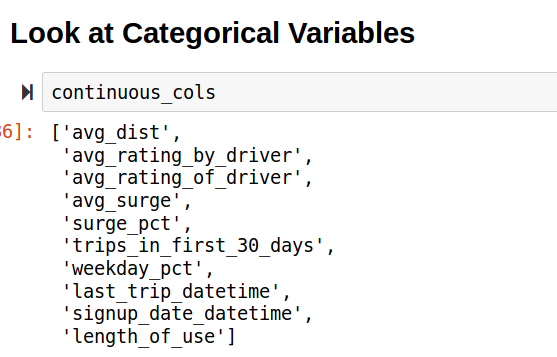
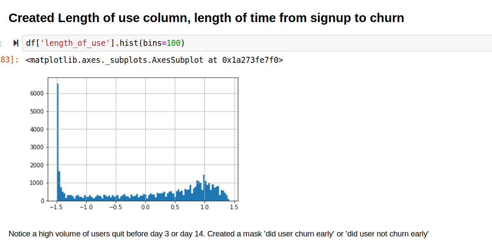
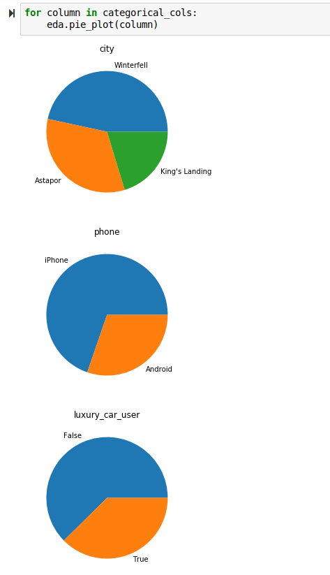
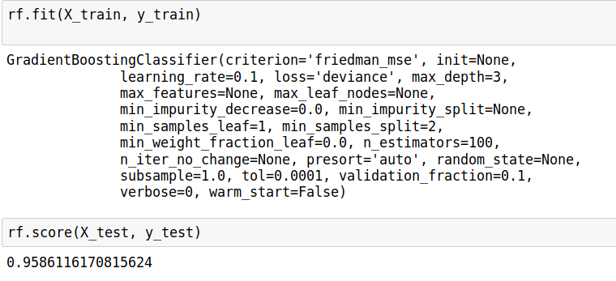
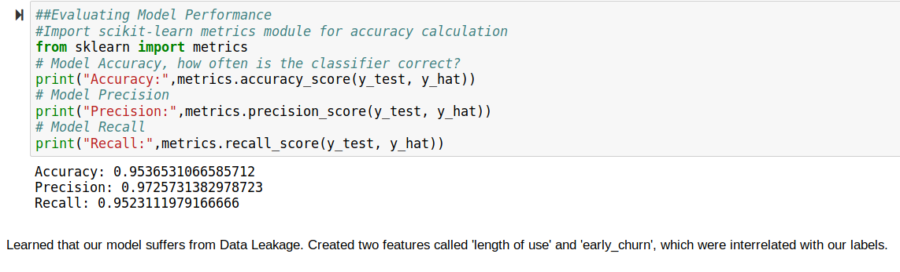
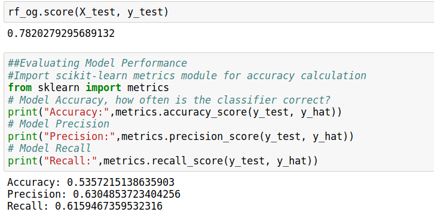
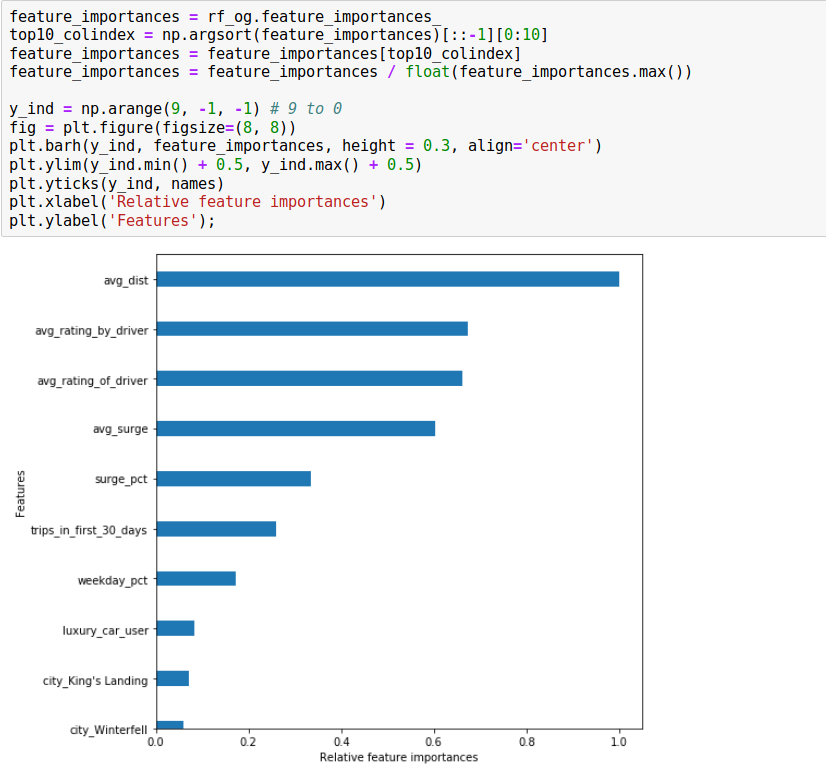

# Churn-Prediction
Assessing which variables correlate with churn in a ridesharing platform

Hello!

I want to share my experiences with a case study that I worked on with data from a ride-sharing platform. There were a lot of lessons that we stumbled upon, and that perhaps one can learn from this.
After reading into our data, there were many Nan values from the columns "ratings by driver" and "ratings of driver." This makes sense since sometimes, we do not rate our driver due to either being busy or just forgetting. If we took the mean of the driver's ratings, it would fall around 3.8. Instead, we decided to take the median rating, since a number of values feel into the 4.0 category.

Afterwards, we decided to take a look at our categorical variables in our data.

As you can see, there are a lot of non continuous variables, which are great. With this data, it will be easier to categorize each user and see that kind of features correlate to churn.

We always find that time is something that is highly correlated to churn. If we can find when the user stops using the app, then we can correctly identify which user will most likely churn. We created a Length of Use feature which takes the difference of the last_trip_datetime and signup_date_datetime.

Since every user is unique, there won't be any huge issues. As sown on the graph below, there is a significant amount of churn within the first few days.

Let us look at the pie charts of some categorical variables. Obviously, Winterfell, Astapor, and King's Landing are placeholders for the actual cities. One can assume, which those three cities would be...

Many of the users on Lyft are iPhone users. Many of them tend to not use a luxury car. This means that if we were to choose which group of people to target, it should be iPhone users.

Next we should fit a model to see how we can predict churn. Gradient Boosting Classifier is definitely one of the better ensemble models out there and it is also one of the most widely used in the DS community.

To explain a little about what gradient boosting actually does, there are some assumptions that we have to make. Usually when we test data, we train our models independently from one another. Instead of assuming independence, we train these models sequentially. Boosting allows us to work towards a better model by improving on the existing one, based on our learning rate. It tries to reduce our MSE every time with every revision.

The gradient part means that it seeks to find the min/max point from our range of values. If we picture an n-dimensional plane, given our surrounding, what values would most likely lead towards the greatest increase of the function. This would be shown by taking the derivative of each predictor.  

After fitting and predicting our model with the test set, we found that it had really high Accuracy, Precision, and Recall. This means that our model had an amazing amount of true positives, which is good!

However, one aspect that we overlooked was why is our model doing so well?
This is due to the fact that our model had access to the length of use, which wouldn't be available for new users. If a new user signs up, how would one be able provide their last trip date used? We can't rely on length of use since it in dependent on our Churn. This makes our data extremely biased, which is not good when performing analysis.

Once we have removed our Length of Use column, we fit the model and predict back on the test set. Our score is .78, and our metric scores fell significantly.

Lastly, we will take a look at our variables. This plot shows what percentage each variable contributed to affecting our score. It shows that average distance contributed to our final model, whereas Winterfell or King's Landing did not contribute as much.

## Conclusion

In our future analysis, we have a few avenues in which we can improve our prediction. We could try experimenting taking out less important variable as well as gathering more data for our EDA. Until then, we can only correctly identify about 78% of customers churning, which is still a good score after cleaning our code.

We ran into a problem with data leakage where we used "length of use" of the app as a predictor of churn. Our model fit too well and it gave us a high accuracy score since it was dependent on our Churn or Y. We should exclude these predictors since we need to analyze new customers.  
